# always_profile_first
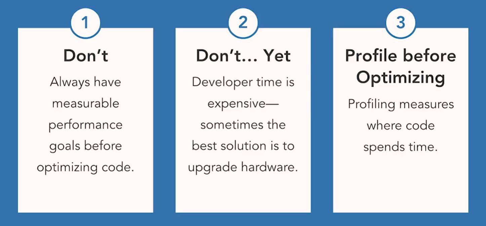

# general tips
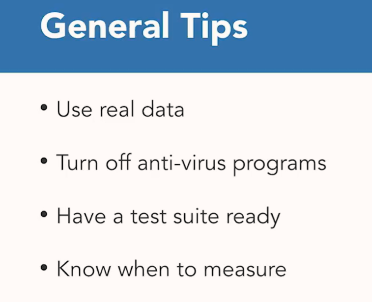

# measure time
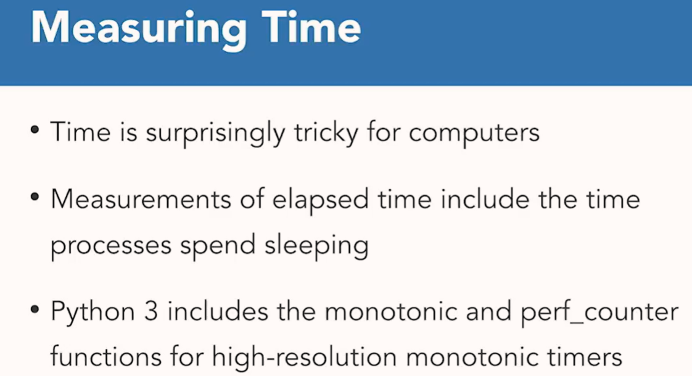

## perf_counter
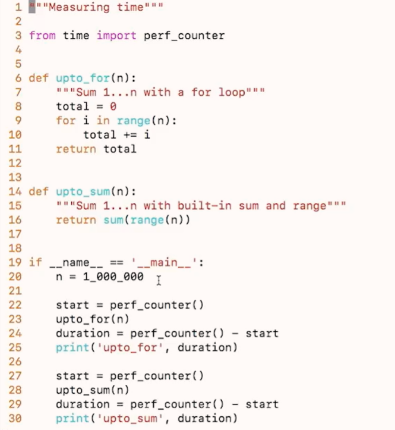

## timeit
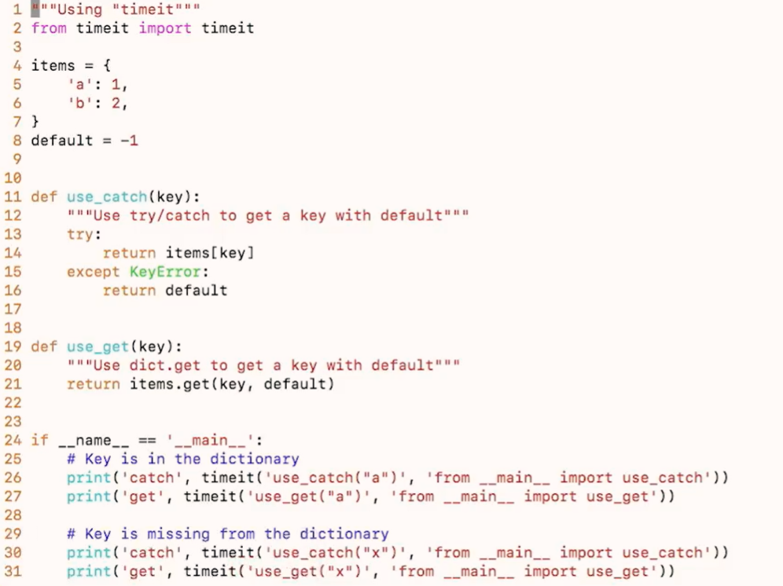

# CPU Profiling
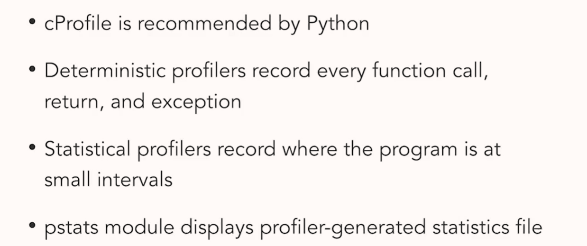

# line_profiler
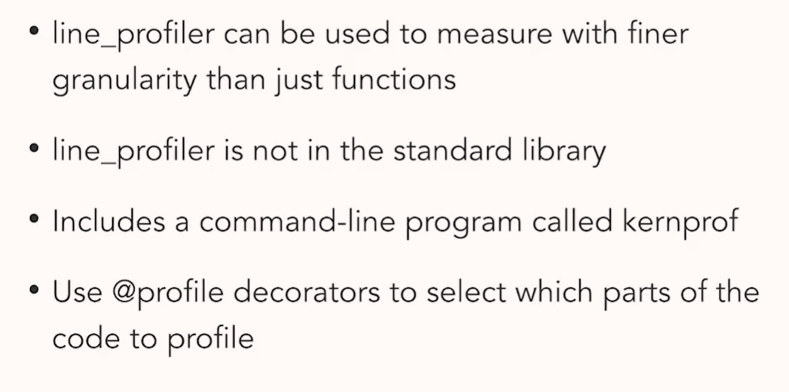

# tracing memory allocations
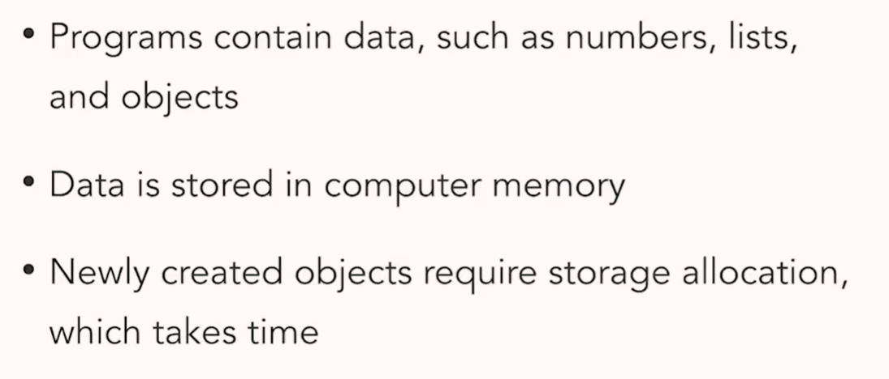

## latency
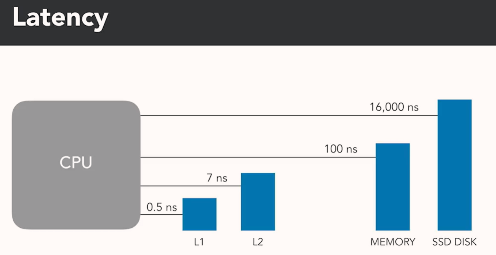
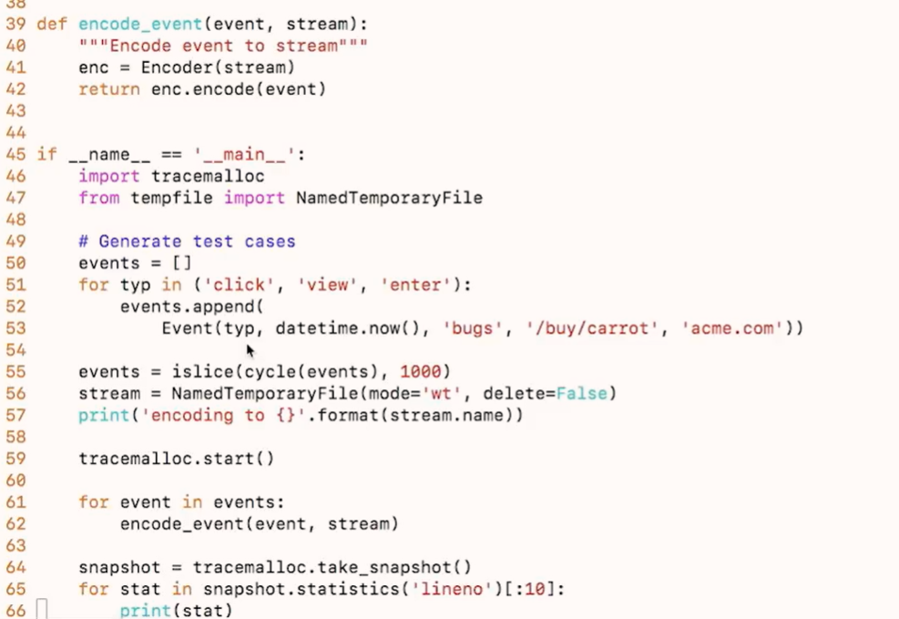

# memory_profiler
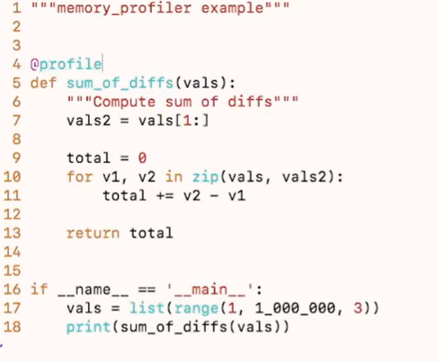
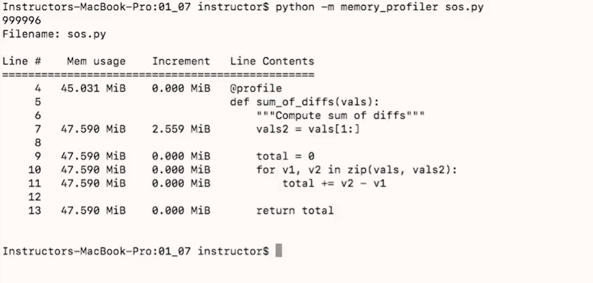
## remove @profile and increase range to 100_000_000
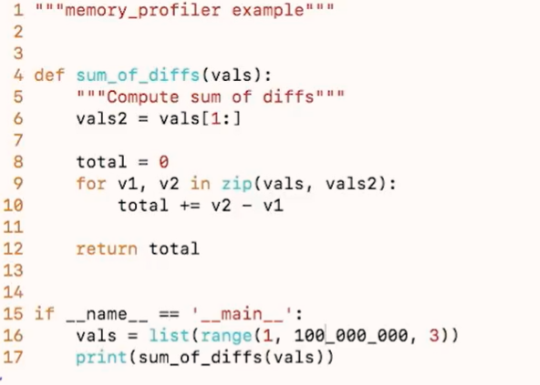

memory continues to grow as time 
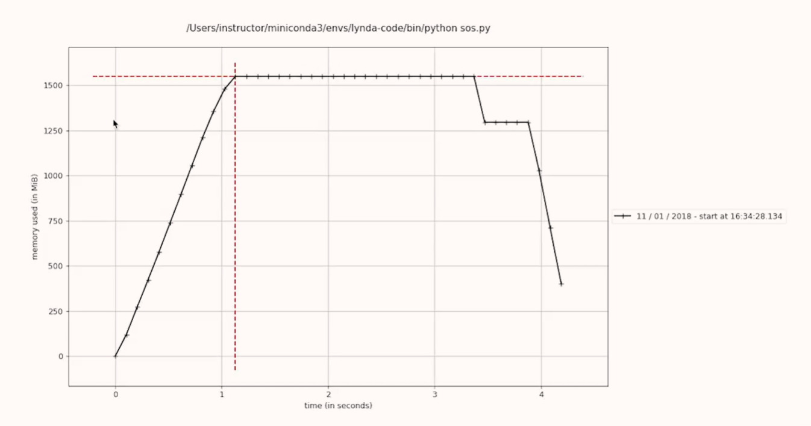

