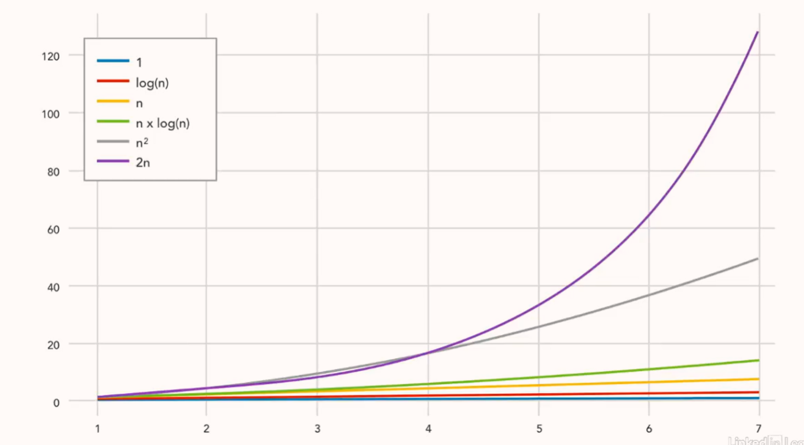
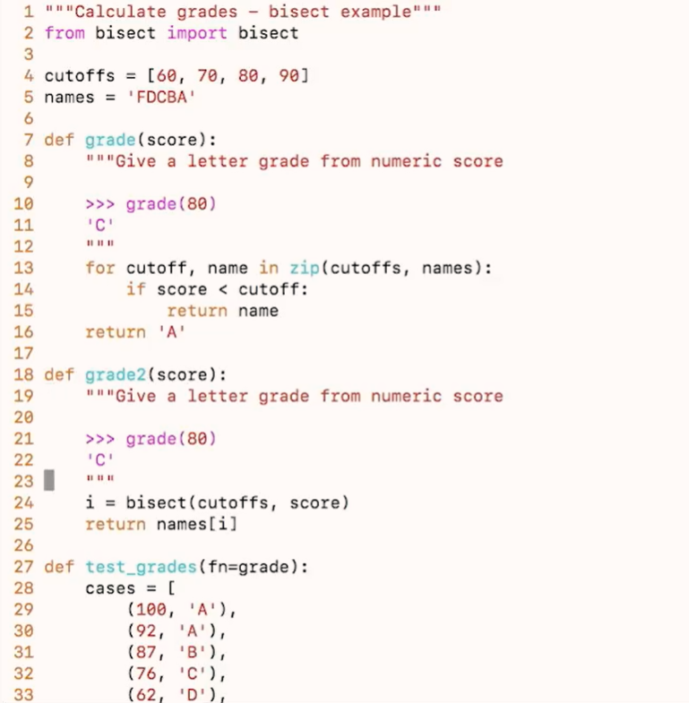
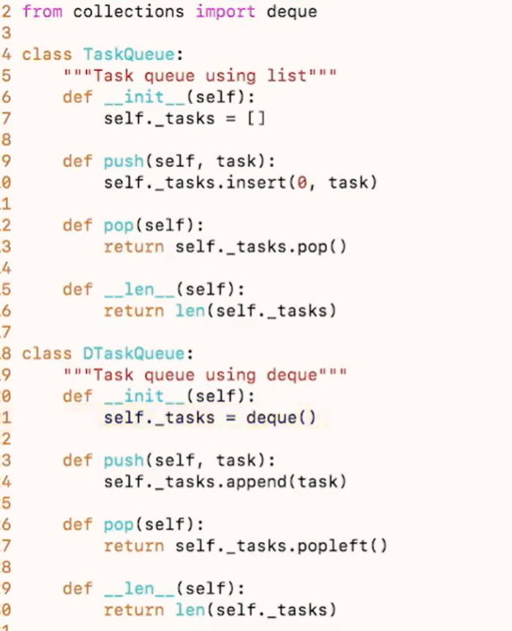

# Big O Notation




# bisect (log(n))


# deque

## Scenarios for Using deque

### 1. If you need to maintain a sliding window or the most recent N records:  
sliding_window = deque(maxlen=N)  
  
### 2. If you need an efficient producer-consumer queue:  
queue = deque()  
queue.append(item)         # Producer adds an item  
item = queue.popleft()     # Consumer retrieves an item  
  
### 3. If you need to limit memory usage and automatically discard old data:  
fixed_size_queue = deque(maxlen=fixed_size)  
  
### 4. If you need queue operations in a multithreaded environment:  
thread_safe_queue = deque()  
  
## Scenarios for NOT Using deque  
### 1. If you need random access to elements in the middle:  
random_access_list = [1, 2, 3, 4]  
element = random_access_list[2]  # Access an element at index 2  
  
### 2. If you need sorting or prioritization:  
import heapq  
priority_queue = []  
heapq.heappush(priority_queue, (priority, item))  # Add item with priority  
highest_priority_item = heapq.heappop(priority_queue)  # Remove highest-priority item  
  
### 3. If you only need a simple LIFO stack:  
lifo_stack = []  
lifo_stack.append(item)  # Push item to stack  
item = lifo_stack.pop()  # Pop item from stack  

# heapq


```python
import heapq

data = [3, 1, 4, 1, 5, 9, 2, 6]
heapq.heapify(data)  # inplace change to heap 
# data: [1, 1, 2, 3, 5, 9, 4, 6]
# heap[0] always the minimum
```
## heapq Big O
* heappush() - O(log n)
* heappop() - O(log n)
* heap[0] - O(1)
* heapify() - O(n)

There are more libraries could leverage, explore by yourself.