# Local caching of names
 
In Python, accessing global variables can be slower than accessing local variables due to the way Python handles

Below normalize2 is faster than normalize1 bcos line #21/22 saving global variables locally to avoid repeated global lookups
 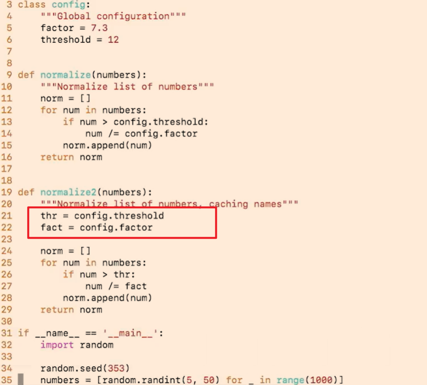
 
Below normalize3 is faster than normalize2 because it caches the append function
 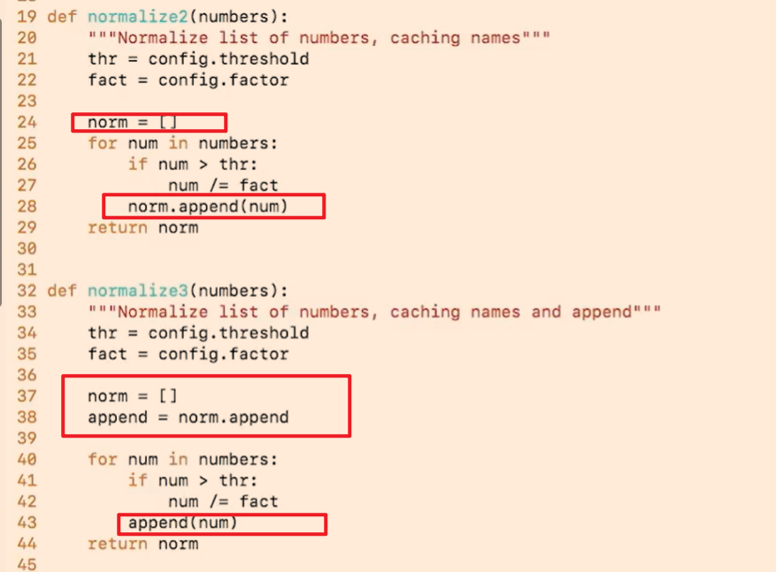

# Remove function calls
`TANSTAAFL: There Ain't No Such Thing As A Free Lunch`

In this example, after removing function calls, the code runs faster.
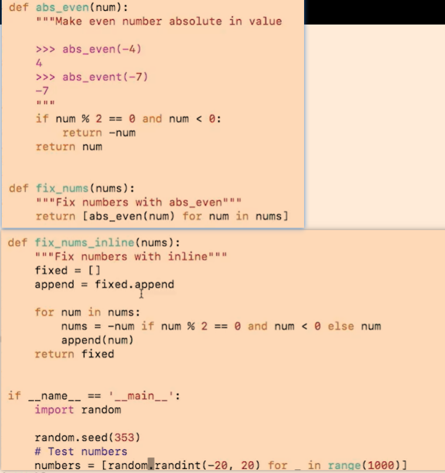
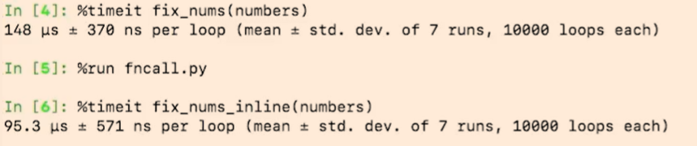

Another example, do not user properties unless you have a good reason
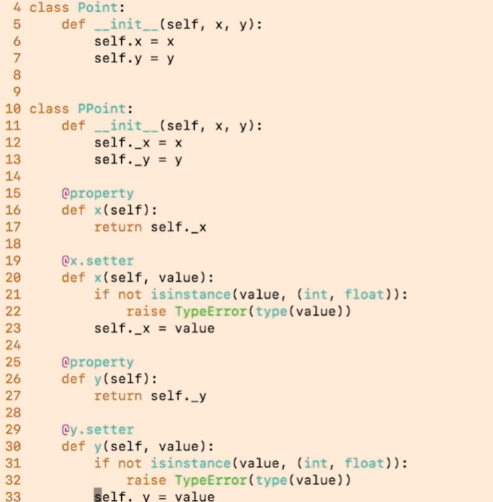
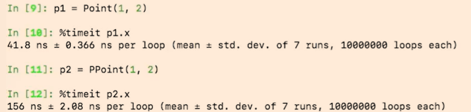

# Using Slots
Using `__slots__` can save memory and speed up attribute access by preventing the creation of a default `__dict__` for each instance.
Downside is you cannot add new attributes dynamically.
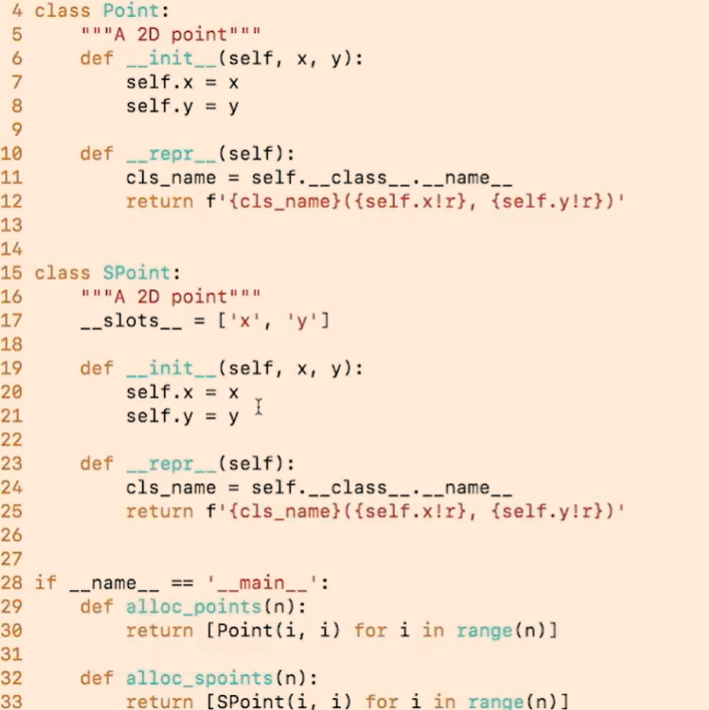
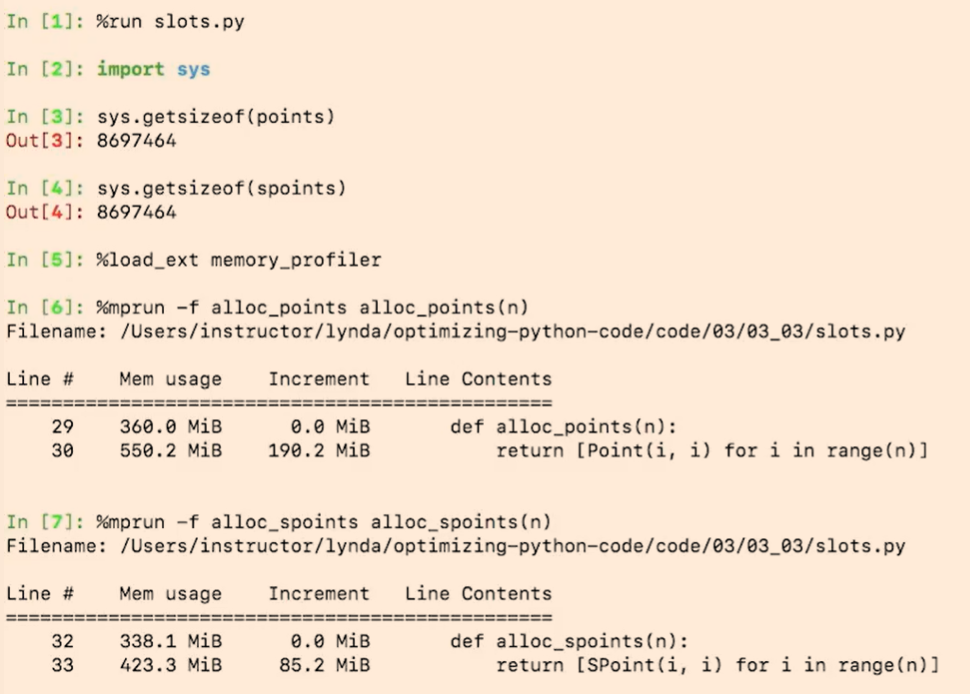

# Using built-in functions
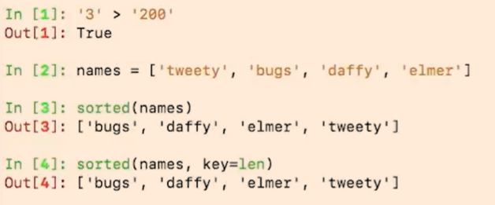
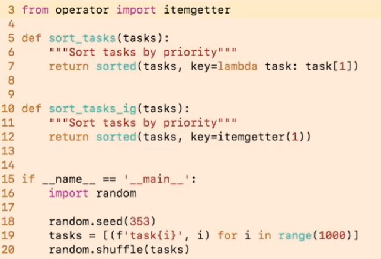
use itemgetter to speed up item access in sorting, there is also attrgetter for getting attributes
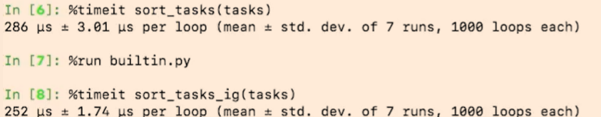

# Allocate
Pre-allocate lists to avoid dynamic resizing during appends.
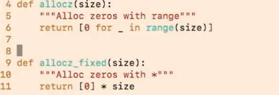
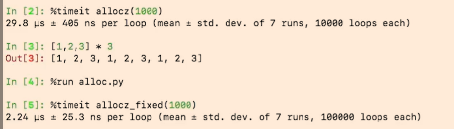
Be cautious to use immutable values in initialization to avoid unintended side effects.
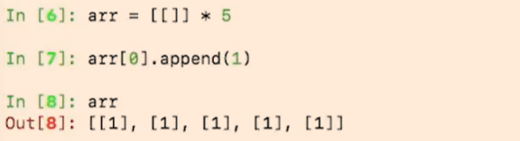
Numpy has ultra fast array operations
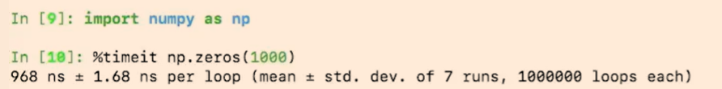
