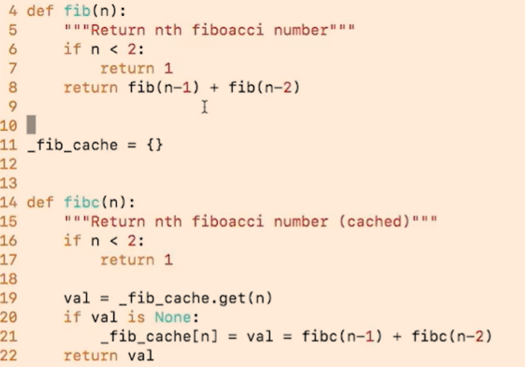
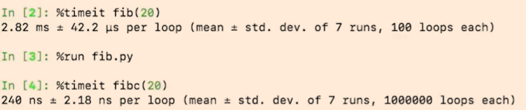
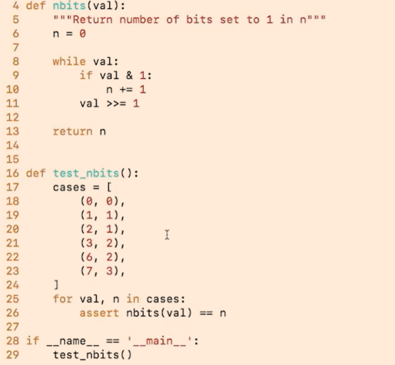
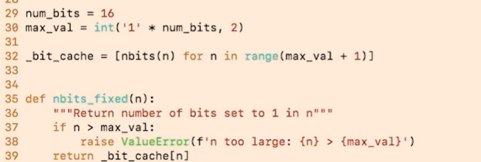
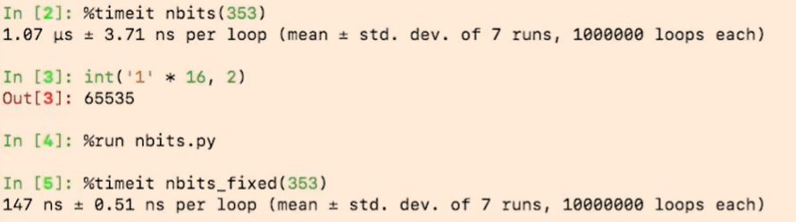
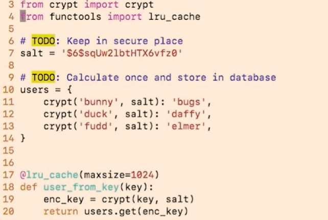
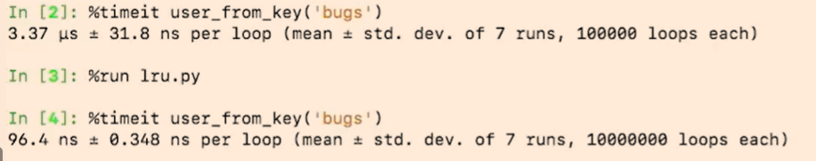
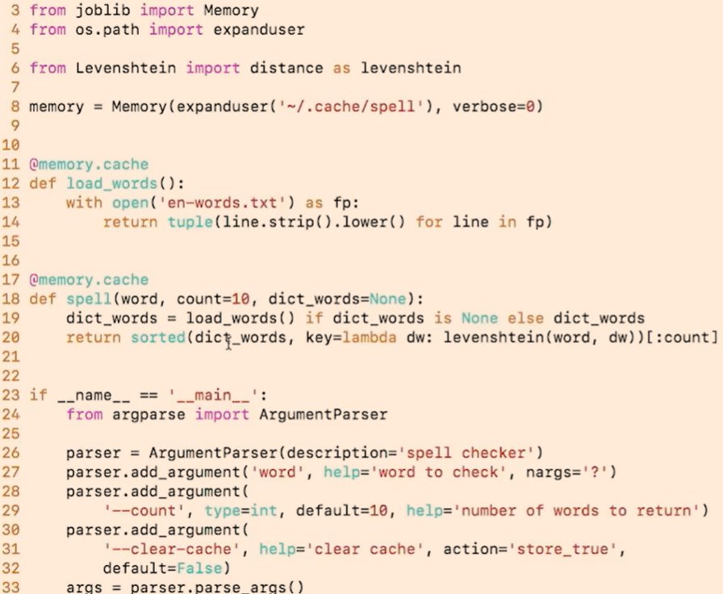
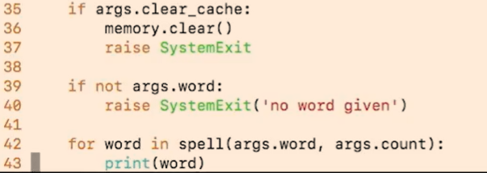
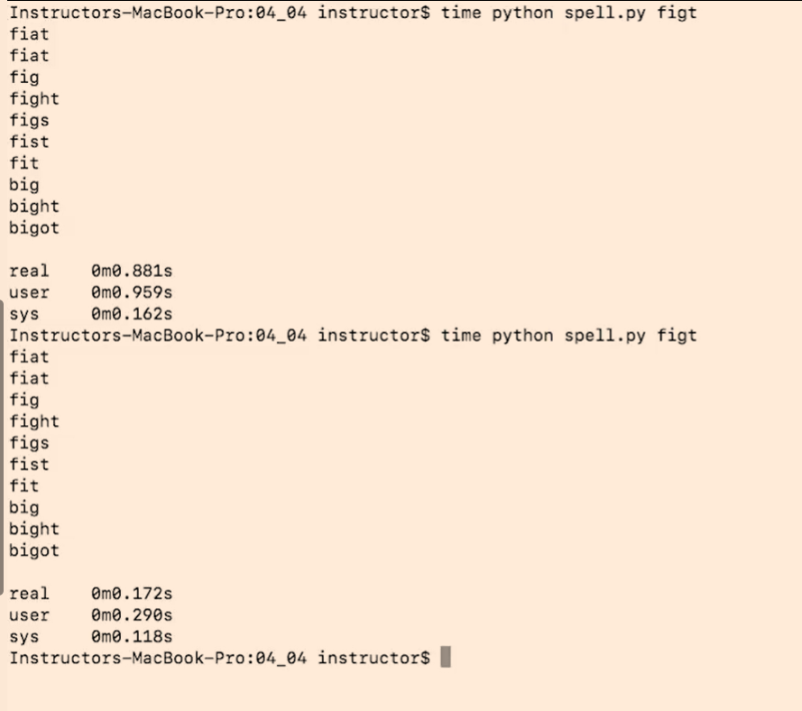

# Overview
This chapter delves into the concept of caching in Python, exploring various techniques and strategies to optimize code performance by storing and reusing previously computed results. Caching can significantly reduce computation time for functions that are called repeatedly with the same arguments.

An Fib example, cache the results of expensive function calls and return the cached result when the same inputs occur again.

# Pre-calculated Caches
Pre-calculated caches involve storing results of computations that are known in advance, allowing for quick retrieval
Notice the nbits function is a pure function, meaning it always produces the same output for the same input without side effects.

(0, 0) → The binary representation of `0` contains 0  `1`  
(1, 1) → The binary representation of `1` contains 1  `1`  
(2, 1) → The binary representation of `10` contains 1  `1`  
(3, 2) → The binary representation of `11` contains 2  `1`  
(6, 2) → The binary representation of `110` contains 2  `1`  
(7, 3) → The binary representation of `111` contains 3  `1`  

if we have a large number of calls to count bits in integers within a certain range, pre-calculating the results for that range can save time during execution.

# lru_cache
The `functools.lru_cache` decorator provides a simple way to implement caching for function results based on their input arguments. It uses a Least Recently Used (LRU) strategy to manage the cache size.

with lru decorator it is faster.

# Joblib
leverage joblib memory to boost levenshtein result

once dictionary changed need to clear cache to avoid wrong results returned 