# Numpy
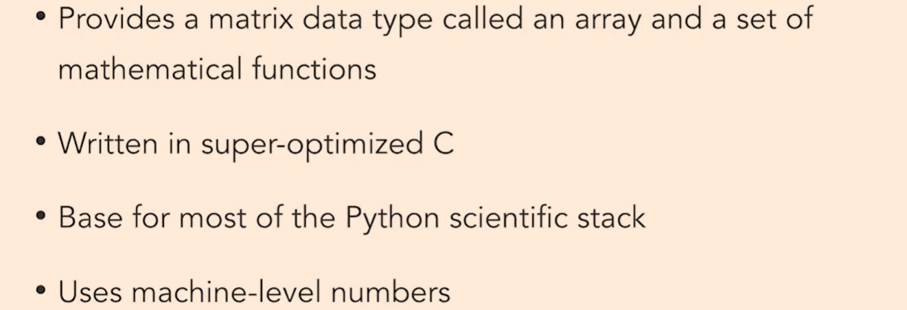
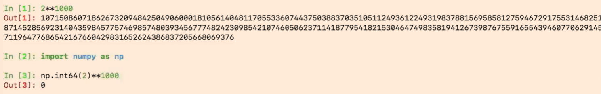
First Cell: `2**1000`

This calculation is performed using Python's built-in integers. Python's integers can grow arbitrarily large because they are implemented as arbitrary-precision numbers. Therefore, the result of 2**1000 is displayed correctly as a very large number.

Second and Third Cell:
```python
import numpy as np  
np.int64(2)**1000  
```
Here, you are explicitly converting the number 2 to a NumPy int64 type. Unlike Python's native integers, int64 has a fixed size of 64 bits. The maximum value an int64 can represent is 
2
63
−
1
=
9
,
223
,
372
,
036
,
854
,
775
,
807
2 
63
 −1=9,223,372,036,854,775,807 (positive range for signed integers). Any number exceeding this range will overflow, causing undefined or incorrect results.

In this case, 2**1000 is far larger than the maximum value int64 can handle. The computation overflows and wraps around, eventually resulting in 0.

## Another example

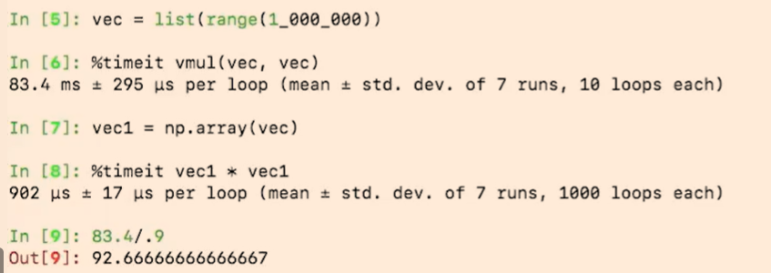
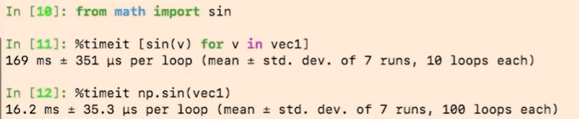


# Numba
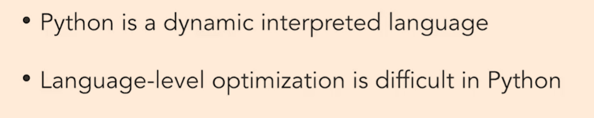
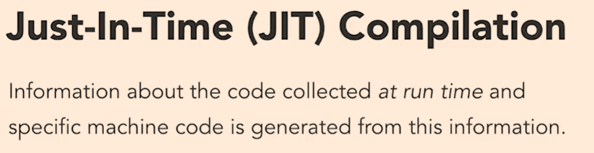
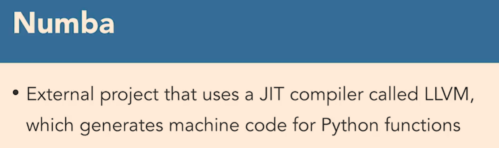
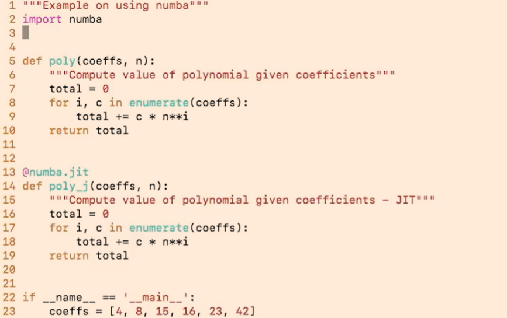
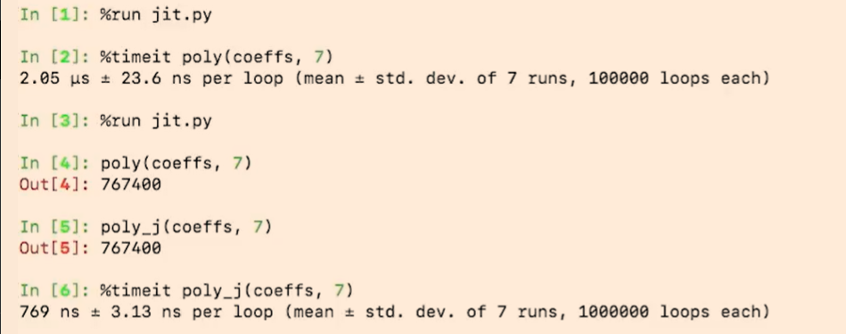

# Cython

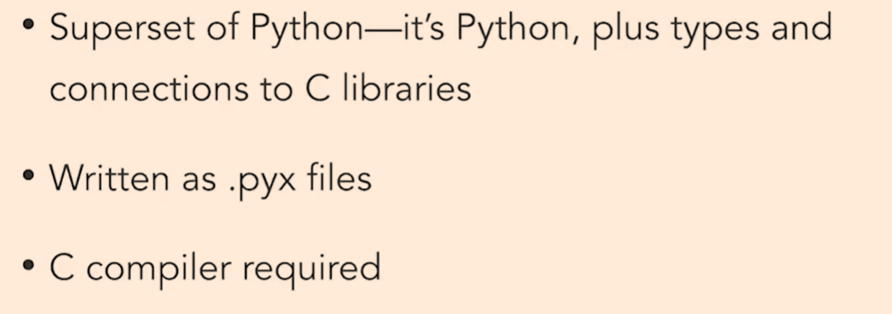
notice the cython version code difference
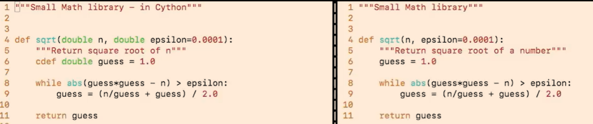
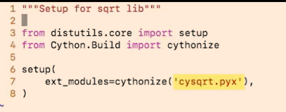
compile once code ready

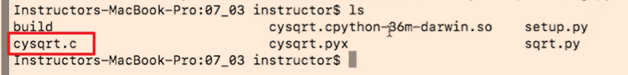
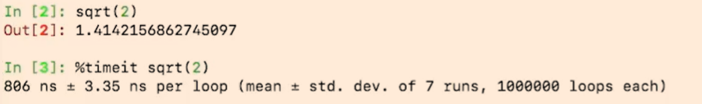
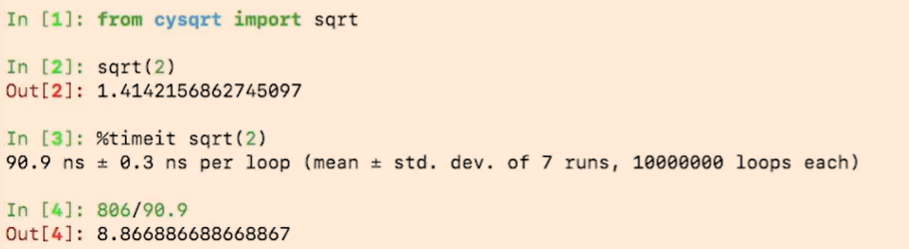
Be aware that Cython may not always outperform pure Python, especially for small or simple functions where the overhead of compilation and type declarations may outweigh the benefits.
Besides, Cython adds complexity to the development process, as it requires an additional compilation step and may introduce compatibility issues with pure Python code.
If your platform changes, the Cython-compiled modules may need to be recompiled to ensure compatibility.

# PyPy
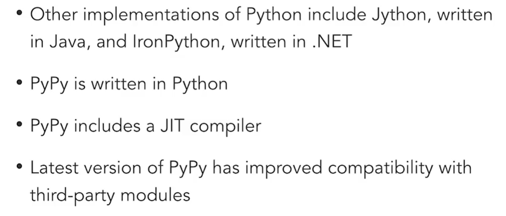
pypy is ~4x faster than cpython in this case


## When is pypy faster than cpython?
- Long-running applications: PyPy's JIT compiler optimizes code during execution, making it more effective for applications that run for extended periods, such as web servers or data processing pipelines.
- Loop-intensive tasks: PyPy excels at optimizing loops and repetitive computations, making it ideal for numerical simulations, data processing, and other tasks that involve extensive looping.
- Applications with dynamic typing: PyPy's JIT compiler can optimize code that heavily relies on dynamic typing, making it suitable for applications that use dynamic features of Python extensively.

## When might PyPy be less effective than CPython?
- Short-lived scripts: For small scripts or programs that execute quickly and terminate, the overhead of PyPy's JIT compilation may outweigh its performance benefits, making CPython a better choice.
- C extension modules: PyPy may not be fully compatible with all C extension modules designed for CPython , which can lead to performance issues or incompatibilities in applications that rely heavily on such extensions.
- Memory usage: PyPy's JIT compilation can lead to higher memory consumption compared to CPython, which may be a concern for memory-constrained environments or applications with large memory footprints.
- Startup time: PyPy typically has a longer startup time compared to CPython due to the JIT compilation process, which may not be ideal for applications that require quick startup times.
- Specific libraries: Some libraries may not be fully optimized or compatible with PyPy, leading to potential performance degradation or functionality issues when using those libraries.
- Debugging and profiling: The JIT compilation process can complicate debugging and profiling, making it more challenging to analyze performance issues or bugs in PyPy compared to CPython.

## How to Move CPython ETL Scripts to PyPy?
If you decide that PyPy is suitable for your use case, here are steps to migrate your CPython ETL scripts:

1. Assess Compatibility with PyPy
Check library compatibility: If your ETL scripts rely on third-party libraries (e.g., pandas, numpy, scipy), check whether they are supported by PyPy. As of 2023, PyPy has good support for many popular libraries, but there may still be limitations.
Use cpyext: PyPy has a compatibility layer (cpyext) for running some CPython C extensions. However, performance may vary, so testing is essential.
2. Install PyPy
Download and install the appropriate PyPy version for your environment from the PyPy website.
Ensure you install the same Python version as your CPython scripts (e.g., PyPy3.9 for Python 3.9 compatibility).
3. Test Your Code
Run your ETL scripts with PyPy to identify any immediate compatibility issues or errors.
Use automated tests (if available) to verify correctness.
4. Optimize for PyPy
Refactor your code to leverage PyPy's strengths (e.g., avoid relying on unsupported libraries or C extensions).
Focus on optimizing loop-heavy or computationally intensive sections of your code.
5. Benchmark Performance
Run performance benchmarks to compare PyPy and CPython.
Use real-world datasets and workload sizes to measure the impact of using PyPy on your ETL scripts.
6. Monitor Memory Usage
Pay attention to memory usage, especially if your ETL scripts process large datasets. PyPy's JIT can sometimes consume more memory than CPython.
7. Debug and Profile
Use tools like vmprof (a profiler for PyPy) to analyze performance and pinpoint bottlenecks.
Be aware that debugging may be more challenging due to JIT optimizations.
8. Deployment
Package your ETL scripts with PyPy and deploy them in your target environment.
Ensure that the deployment environment has PyPy installed or bundle PyPy with your application.
Things to Watch Out For:
Library Compatibility: If your ETL scripts rely on specific libraries, you may need to test and sometimes replace them with alternatives that work with PyPy.
Startup Time: If your ETL jobs are very short-lived, PyPy's startup overhead might reduce overall performance.
Memory Constraints: If your scripts are memory-intensive, monitor memory usage closely.

## Final Thoughts:
PyPy can significantly improve performance for certain use cases, particularly long-running or loop-intensive ETL tasks. However, testing and benchmarking are critical to ensure compatibility and performance gains. If your ETL scripts rely heavily on unsupported libraries or C extensions, you may need to refactor parts of your code or stick to CPython.


# C Extensions
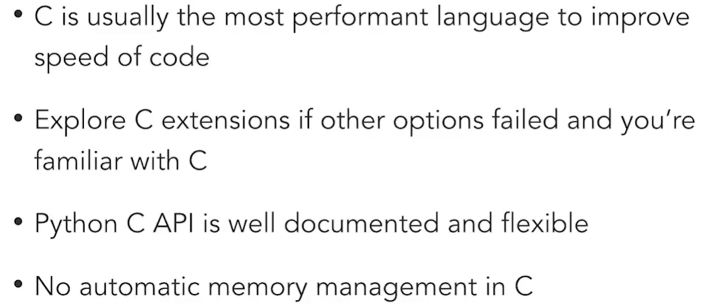
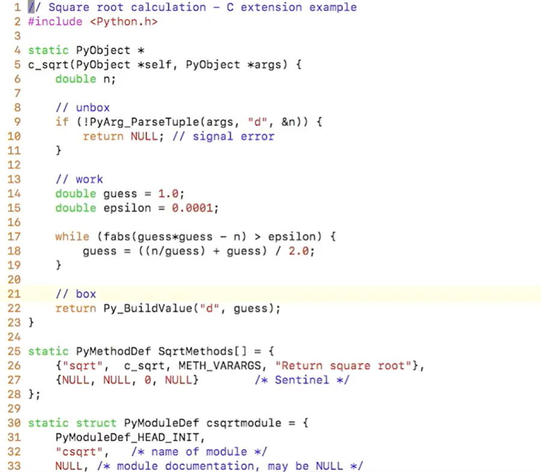
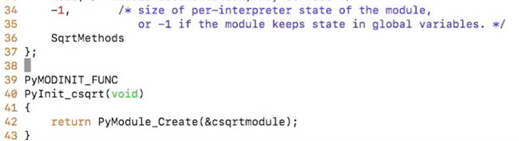

in this case, ~7x faster
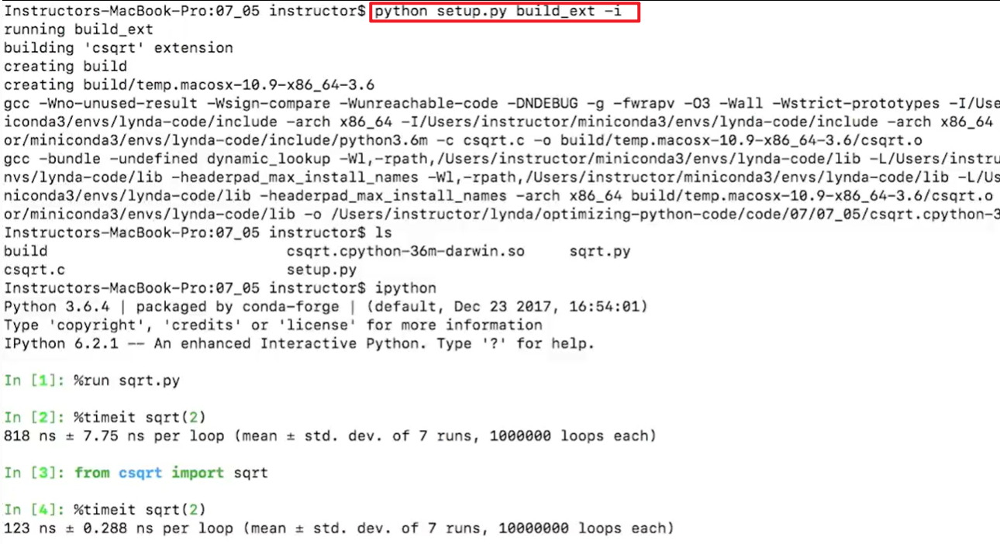