# Working with a process
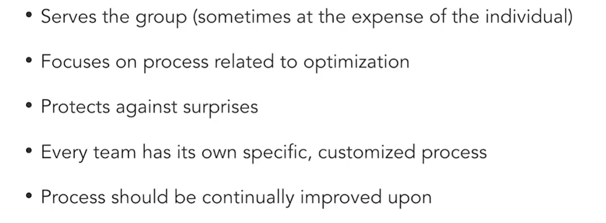

# Design and Code Review
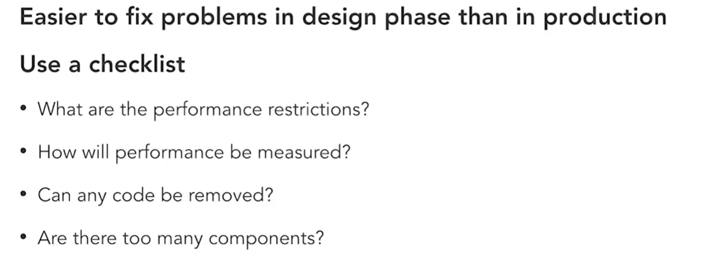
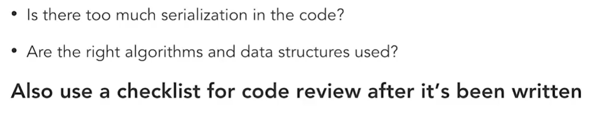

# Benchmarks
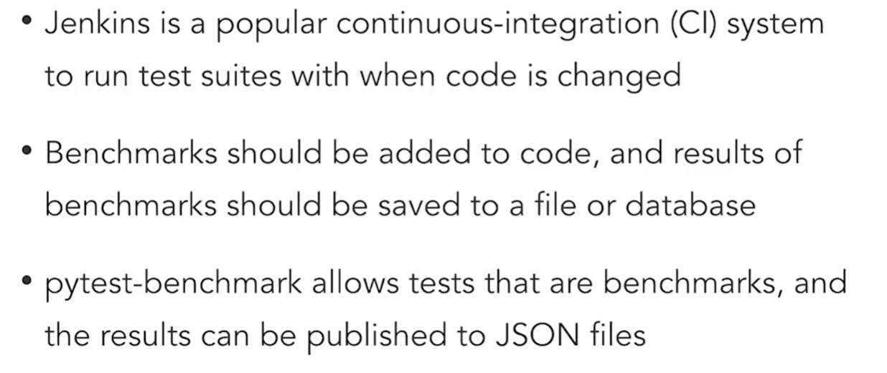
 
examples: pypy vs cpython
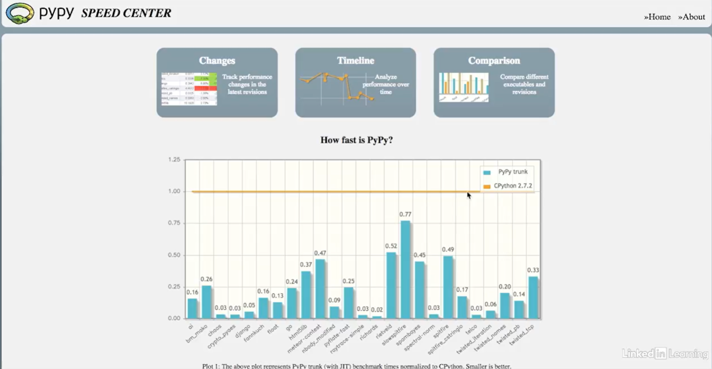

before adding cache
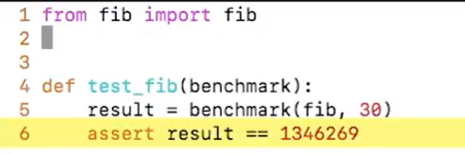
using pytest benchmark
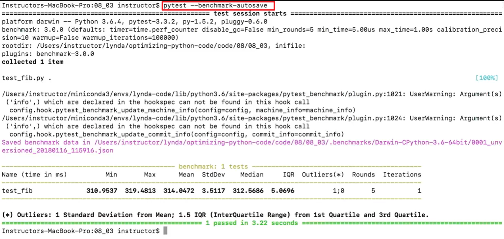
add cache
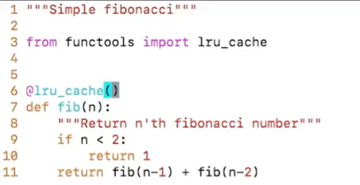
using pytest benchmark compare
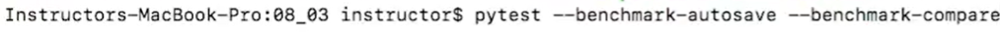
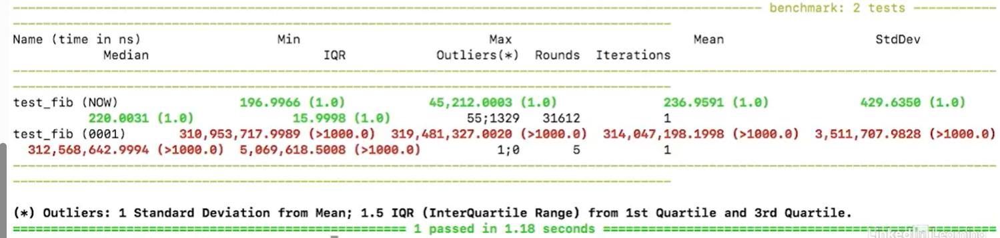

# Monitoring and Alerting
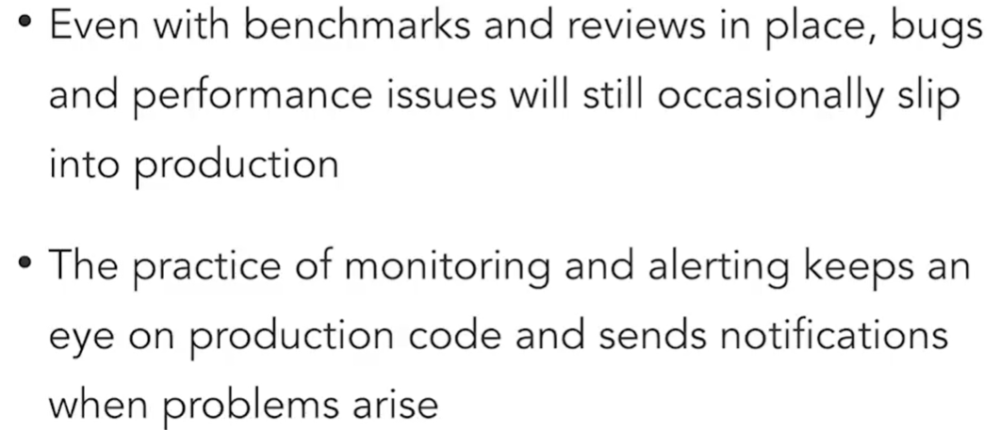

Grafana

